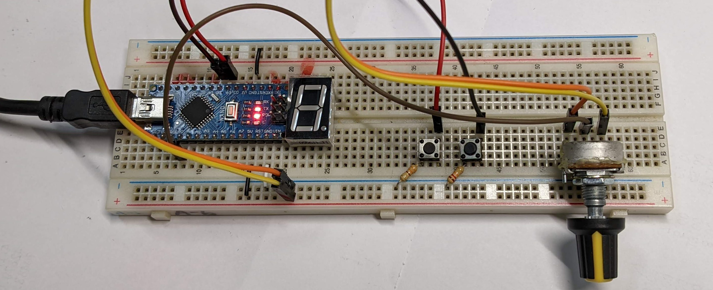

# A steering wheel using just EV3 and arduino

## Why?

A projecgt build just for me to get more fun in the game (Starts at 2022/1/20 still in progress).

Building a steering wheel using EV3, Lego parts and Arduino nano. Transferring data using both and bluetooth and USB cable.

## Software and Hardware

### Software
- [vJoy](http://vjoystick.sourceforge.net/joomla/) - bridge gape between any devices by simulating a virtual joystick
- [vJoySerialFeeder](https://github.com/Cleric-K/vJoySerialFeeder) - reading data from COM port (Arduino) and feed into vjoy 

There are many library for Arduino that can turn arduino into a [HDI](https://www.arduino.cc/en/Reference/HID) controller
but it only support direct USB connections.  
Unfortunatelly not many device support it including my nano board.
  
vjoySerialFeeder is the only one I found that is useable for my nano board and also many other boards. Because it uses serial port for 
communication so just you just need a cable to connect from Arduino to your computer and find the COM port of and press connect. 

Code : [Arduino example code](https://github.com/Cleric-K/vJoySerialFeeder/tree/master/Arduino/Joystick) - push data from arduino through serial port

### Hardware
- Arduino - to receve data from any phycial device or button and out put it from serial port to computer
  - CH-05 - bluetooth device for arduino to transfer data 

- EV3 - to control the motors and monitor rotation angle of the physical wheel 

## Process Record

### Day1 2022/1/21 - Arduino to computer

Done pushing data from Arduino to the vjoyfeeder and connect it into vjoy. Able to control the truck in game using two button and one analog input to control acceleration,brake and turning.

Youtube video link : 

### Day3 2022/1/22 - trying to connect Arduino and EV3 via USB cable

today I found out that RobotC didn't even support the full feture of bluetooth mailbox so I quickly switch to ev3dev and booted it up. But still cant find a way to connect 
Arduiino togeter but I think I found someuseful informations.

*https://github.com/ev3dev/ev3dev/issues/1482

*https://github.com/ev3dev/ev3dev/issues/1159

*https://docs.ev3dev.org/projects/lego-linux-drivers/en/ev3dev-stretch/ev3.html#in-port-raw-mode

*https://www.ev3dev.org/docs/kernel-hackers-notebook/ev3-uart/

