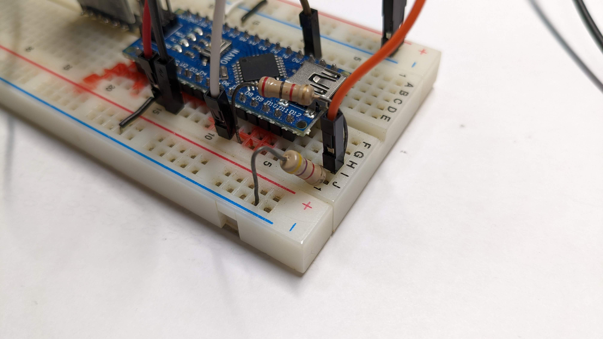
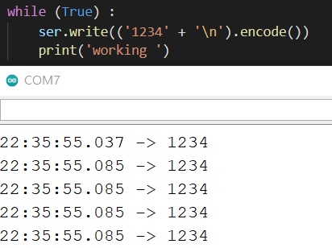
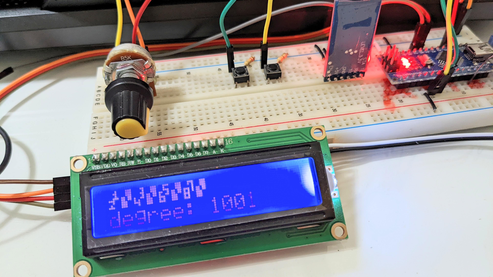

# A steering wheel using EV3 and arduino

## Why?

I think it is more fun to play with a physical steering wheel, but all the steering wheel on the market are too expensive. Making one is the best way to learn and get the result.

Building a steering wheel using EV3, Lego parts and Arduino nano. Transferring data using both and bluetooth and USB cable.

## Result 


## Software and Hardware

### Software
> Necessary 
- [vJoy](http://vjoystick.sourceforge.net/joomla/) - bridge gape between any devices by simulating a virtual joystick
- [vJoySerialFeeder](https://github.com/Cleric-K/vJoySerialFeeder) - reading data from COM port (Arduino) and feed into vjoy


> Useful tools
- [PuTTY](https://www.putty.org/) - support Serial and SSH easy to access the ev3dev terminal and monitor the bluetooth COM port
- [etcher](https://etcher.download/) - a tool to flash ev3dev image on to the SD card <br>

There are many library for Arduino that can turn arduino into a [HDI](https://www.arduino.cc/en/Reference/HID) controller
but it only support direct USB connections.
Unfortunatelly not many device support it including my nano board.
  

vjoySerialFeeder is the only one I found that is useable for my nano board and also many other boards. Because it uses serial port for 
communication so just you just need a cable to connect from Arduino to your computer and find the COM port and press connect. <br>


Code : [Arduino example code](https://github.com/Cleric-K/vJoySerialFeeder/tree/master/Arduino/Joystick) - push data from arduino through serial port


### Libraries for Arduino
- [AltSoftSerial](https://www.arduino.cc/reference/en/libraries/altsoftserial/) - adding software serial port to arduino >> use for the bluetooth devices or more
- [LiquidCrystal_I2C](https://www.arduino.cc/reference/en/libraries/liquidcrystal-i2c/) - display LCD library By.Frank de Brabander


### Hardware
- Arduino - to receve data from any phycial device or button and out put it from serial port to computer
  - CH-05 - bluetooth device for arduino to transfer data 
  - LCD display(optional) - to display the state of the pin both digital and analog.
  
- EV3 - to control the motors and monitor rotation angle of the physical wheel 
  - flash ev3dev on to the SD card [ev3dev offical site](https://www.ev3dev.org/)


## Process Record

### Day1 2022/1/21 - Arduino to computer

Done pushing data from Arduino to the vjoyfeeder and connect it into vjoy. Able to control the truck in game using two button and one analog input to control acceleration,brake and turning.


Youtube video link : [Feed data to game (Arduino)](https://youtu.be/CkFdMmpg-gE)

### Day2 2022/1/21 - added CH-05 bluetooth device to Arduino board

I follow the procress from this video( [GreatScott's Arduino + Bluetooth](https://youtu.be/x3KAXjnP06o) ). Be careful of the different voltage of the bluetooth device and the arduino board. Bluetooth's Rx receves 3.3V but Arduino outputs 5V. 

The connection from Arduino to the computer uses Tx and Rx pin to transmiss data. One way to connect the bluetooth device is using Software Serial (software serial libraries [difference](https://arduino.stackexchange.com/questions/34126/whats-the-difference-between-all-the-software-serial-libraries-which-one-is-ar)). 
After all I chooses AltSoftSerial it seems like it the best of all libraries. But there are also some downsides you could only add one serial port and the pins of the ports are fixed so you couldn't change it ([more informations](https://www.pjrc.com/teensy/td_libs_AltSoftSerial.html)).

 


### Day3 2022/1/22 - trying to connect Arduino and EV3 via USB cable

today I found out that RobotC didn't even support the full feture of bluetooth mailbox so I quickly switch to ev3dev and booted it up. But still cant find a way to connect 
Arduiino togeter but I think I found someuseful informations.

*https://github.com/ev3dev/ev3dev/issues/1482

*https://github.com/ev3dev/ev3dev/issues/1159

*https://docs.ev3dev.org/projects/lego-linux-drivers/en/ev3dev-stretch/ev3.html#in-port-raw-mode

*https://www.ev3dev.org/docs/kernel-hackers-notebook/ev3-uart/

#### Update: How to use USB serial port on ev3 using ev3dev? 

1.Find serial port avalible <br>

> SSH into the terminal
```cmd
#change directory to /dev
cd /dev  

#list all element in folder 
ls 
```
> you'll find something like this <br>


> find the port you like to use for me it's 'ttyUSB0'
> #### !!!Notice the USB port needs to be connect with something other wise it won't show up!!!


2.Python code send message (using ttyUSB0 port for example) 
```Python3
##    serial.Serial(Serial_port, baud_rate)
ser = serial.Serial("/dev/ttyUSB0", 115200)

#send message
ser.write(bytes)
```
> Through this method I can now communicate EV3 with arduino using Serial port 
> blutooth serial port is also possible using this method but you need to find the correct port first.

### Day4 2022/1/23 - connect Ev3 to Arduino's HC-05(bluetooth device)

Today I found out that there is only one USB port avalible for Serial on the nano board, so forget what I did yesterday because I wont use that USB port any more.
I'm switching bluetooth to communicate with Ev3 instead.

1. start from the ev3 and pair the bluetooth device 
  > SSH into ev3 use bluetoothctl to pair with the CH-05 --> [details from Dmitri Iouchtchenko](https://gist.github.com/0/c73e2557d875446b9603)
2. send message from using python (similar from yesterday)
```Python
import serial
ser = serial.Serial("/dev/rfcomm0", 9600)
# the /dev/rfcomm0 is bind with the serial port in the first step
ser.write(bytes)
```
3. Arduino receive from Ev3 via bluetooth

    because I need to receive multi digits number but I could figuer it out because the .write() will send message sepearty.
    It's not until I found this post [Serial input Basics](https://forum.arduino.cc/t/serial-input-basics-updated/382007) (Example 2) that I know how to get it working. It's 
    simply determine where to end the reading and let out the hole data so there won't be partial data.
    After pairing the two I started a simple test and it did work well. Now I can send the roation degree of the motor to the Arduino and let it do the job

  <-- Arduino(COM7) printing values that was send by ev3 via bluetooth


### Day5 2022/1/25 - add bluetooth auto connection and reset the turning degree of the wheel

1. auto bind bluetooth device 

    I don't know why but every time after rebooting the binded "rfcomm0" will be reset and disapear in /dev folder. so I find a way to automatically bind the bluetooth 
    address into the /dev folder in order for the python serial to work. 
```Python
import os
# just a simple one line command for linux system to enter password
os.system('echo <password for system> | sudo -S rfcomm bind 0 <bluetooth address>') # bluetoothctl to find address
```
> It will bind the address into /dev if it haven't be else It will just pass to next line

2. rest motor encoder to defult position

    And then when I was playing with the will I find out that if I turn too fast or to hard the encoder of the motor won't keep up with the real degree of my turning rate.
    There was no way to solve the problem so I just add on button when it was press it will reset the wheel degree to the defult degree.

    You can also set to other buttons [ev3 Buttons](https://sites.google.com/site/ev3devpython/learn_ev3_python/buttons)

```Python
from ev3dev2.auto import Button
if(Button.enter):
  R1.reset()
  L1.reset()
  # L1 and R1 is the LargeMotor
```
### Day6-7 2022/1/26-27 - setup LCD display to display pin state

Added a LCD I2C screen (16*2) to display the state of the digital input and analog input.

Uses custom char to display two pin in two block of the LCD display. I fount a website that can  [generate custom character](https://maxpromer.github.io/LCD-Character-Creator/)
automatically but it can only setup 8 custom char limited to the ram of the display.

create custom char :
```Python
byte myChar= {
  """
  use the link to generate custom char. Both Hex and Binary are useable.
  """
};
lcd.createChar(<char num>, myChar);
# if there is more custom char the char num should be distinct but between 0~7
lcd.write(<char num>);
```

[LCD_Display_vido](https://youtu.be/yhB6UovjPHQ)
