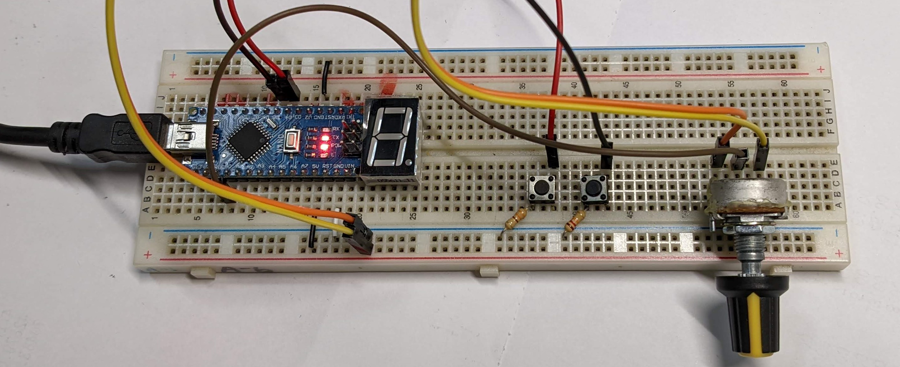
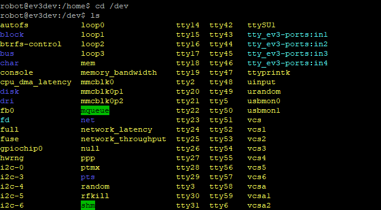

# A steering wheel using just EV3 and arduino

## Why?

A projecgt build just for me to get more fun in the game (Starts at 2022/1/20 still in progress).

Building a steering wheel using EV3, Lego parts and Arduino nano. Transferring data using both and bluetooth and USB cable.


## Software and Hardware

### Software
> Necessary 
- [vJoy](http://vjoystick.sourceforge.net/joomla/) - bridge gape between any devices by simulating a virtual joystick
- [vJoySerialFeeder](https://github.com/Cleric-K/vJoySerialFeeder) - reading data from COM port (Arduino) and feed into vjoy


> Useful tools
- [PuTTY](https://www.putty.org/) - support Serial and SSH easy to access the ev3dev terminal and monitor the bluetooth COM port
- [etcher](https://etcher.download/) - a tool to flash ev3dev image on to the SD card <br>

There are many library for Arduino that can turn arduino into a [HDI](https://www.arduino.cc/en/Reference/HID) controller
but it only support direct USB connections.
Unfortunatelly not many device support it including my nano board.
  

vjoySerialFeeder is the only one I found that is useable for my nano board and also many other boards. Because it uses serial port for 
communication so just you just need a cable to connect from Arduino to your computer and find the COM port and press connect. <br>


Code : [Arduino example code](https://github.com/Cleric-K/vJoySerialFeeder/tree/master/Arduino/Joystick) - push data from arduino through serial port


### Libraries for Arduino
- [AltSoftSerial](https://www.arduino.cc/reference/en/libraries/altsoftserial/) - adding software serial port to arduino >> use for the bluetooth devices or more


### Hardware
- Arduino - to receve data from any phycial device or button and out put it from serial port to computer
  - CH-05 (optional) - bluetooth device for arduino to transfer data 

- EV3 - to control the motors and monitor rotation angle of the physical wheel 
  - flash ev3dev on to the SD card 


## Process Record

### Day1 2022/1/21 - Arduino to computer

Done pushing data from Arduino to the vjoyfeeder and connect it into vjoy. Able to control the truck in game using two button and one analog input to control acceleration,brake and turning.



Youtube video link : []()

### Day2 2022/1/21 - added CH-05 bluetooth device to Arduino board

I follow the procress from this video( [GreatScott's Arduino + Bluetooth](https://youtu.be/x3KAXjnP06o) ). Be careful of the different voltage of the bluetooth device and the arduino board. Bluetooth's Rx receves 3.3V but Arduino outputs 5V. 

The connection from Arduino to the computer uses Tx and Rx pin to transmiss data. One way to connect the bluetooth device is using Software Serial (software serial libraries [difference](https://arduino.stackexchange.com/questions/34126/whats-the-difference-between-all-the-software-serial-libraries-which-one-is-ar)). 
After all I chooses AltSoftSerial it seems like it the best of all libraries. But there are also some downsides you could only add one serial port and the pins of the ports are fixed so you couldn't change it ([more informations](https://www.pjrc.com/teensy/td_libs_AltSoftSerial.html)).

picuter ::::::

### Day3 2022/1/22 - trying to connect Arduino and EV3 via USB cable

today I found out that RobotC didn't even support the full feture of bluetooth mailbox so I quickly switch to ev3dev and booted it up. But still cant find a way to connect 
Arduiino togeter but I think I found someuseful informations.

*https://github.com/ev3dev/ev3dev/issues/1482

*https://github.com/ev3dev/ev3dev/issues/1159

*https://docs.ev3dev.org/projects/lego-linux-drivers/en/ev3dev-stretch/ev3.html#in-port-raw-mode

*https://www.ev3dev.org/docs/kernel-hackers-notebook/ev3-uart/

#### Update: How to use USB serial port on ev3 using ev3dev? 

1.Find serial port avalible <br>

> SSH into the terminal
```cmd
#change directory to /dev
cd /dev  

#list all element infolder 
ls 
```
> you'll find something like this <br>


> find the port you like to use for me it's 'ttyUSB0'
> #### !!!Notice the USB port needs to be connect with something other wise it won't show up!!!


2.Python code send message (using ttyUSB0 port for example) 
```Python3
##    serial.Serial(Serial_port, baud_rate)
ser = serial.Serial("/dev/ttyUSB0", 115200)

#send message
ser.write(bytes)
```
> Through this method I can now communicate EV3 with arduino using Serial port 
> blutooth serial port is also possible using this method but you need to find the correct port first.
